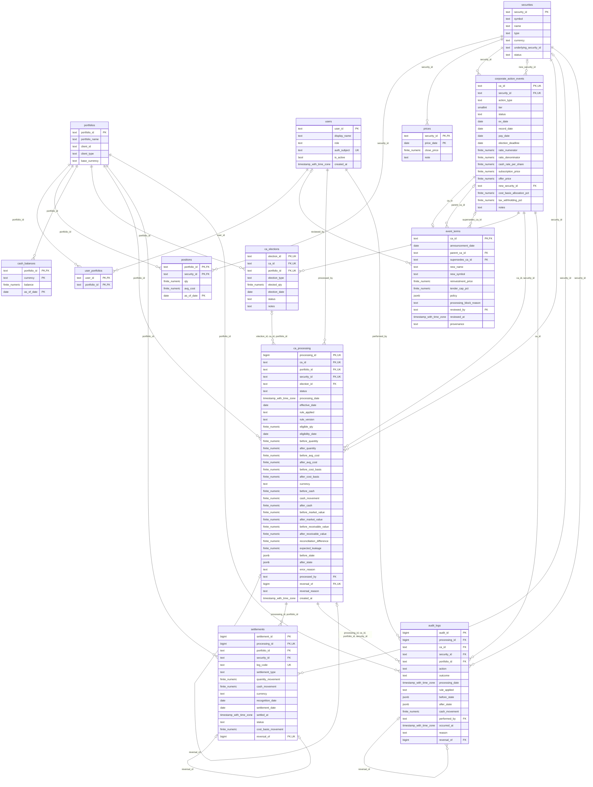

# ER diagram

Generated from implemented CREATE TABLE and ALTER TABLE foreign-key definitions.

Self-links preserve security lineage, event correction/DRIP relationships and immutable reversal history.
